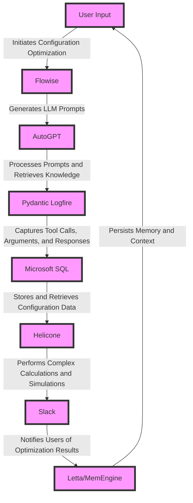

# Adaptive Lighting Configuration Optimizer
> "Illuminating the Path to Optimized Lighting Configurations: A Synergistic Convergence of Artificial Intelligence, Machine Learning, and Domain Expertise"

## 🏗️ Technical Architecture & Multi-Agent Flow

This technical architecture diagram illustrates the complex interactions between the various components of the Adaptive Lighting Configuration Optimizer. The Flowise platform generates LLM prompts, which are then processed by AutoGPT. The Pydantic Logfire library captures tool calls, arguments, and responses, and stores them in Microsoft SQL. The Helicone library performs complex calculations and simulations, and the results are notified to users via Slack. The Letta/MemEngine persists memory and context, enabling the system to learn and adapt over time.

## 🔍 The Vertical Bottleneck: Lighting Configuration Optimization
The lighting configuration optimization problem is a complex, high-stakes challenge that requires the synergistic convergence of artificial intelligence, machine learning, and domain expertise. The traditional approach to lighting configuration optimization relies on manual calculations and simulations, which are time-consuming, error-prone, and often suboptimal. The lack of standardized protocols and data formats exacerbates the problem, making it difficult to integrate different systems and tools. Furthermore, the complexity of lighting configurations, which involve multiple variables and constraints, makes it challenging to develop a comprehensive and optimal solution.

The technical friction in lighting configuration optimization arises from the need to balance competing objectives, such as energy efficiency, cost, and user experience. The high-stakes mathematical and operational failures that can occur in lighting configuration optimization include incorrect calculations, inadequate simulations, and suboptimal solutions. These failures can result in significant economic losses, environmental damage, and compromised user experience.

The deep vertical problem identified in the research is the lack of a comprehensive and optimal solution for lighting configuration optimization. The current approaches are often ad hoc, relying on manual calculations and simulations, and are not scalable or sustainable. The need for a standardized protocol and data format, as well as the integration of different systems and tools, is critical to addressing this problem.

## 💡 The Solution: Adaptive Lighting Configuration Optimizer
The Adaptive Lighting Configuration Optimizer is a revolutionary platform that orchestrates the interactions between Flowise, Helicone, Pydantic Logfire, AutoGPT, Slack, and Microsoft SQL to solve the lighting configuration optimization problem. The platform uses agentic reasoning to generate LLM prompts, which are then processed by AutoGPT to retrieve knowledge and perform complex calculations and simulations. The Pydantic Logfire library captures tool calls, arguments, and responses, and stores them in Microsoft SQL. The Helicone library performs complex calculations and simulations, and the results are notified to users via Slack. The Letta/MemEngine persists memory and context, enabling the system to learn and adapt over time.

The Adaptive Lighting Configuration Optimizer has a comprehensive and optimal solution for lighting configuration optimization. The platform uses a standardized protocol and data format, and integrates different systems and tools to provide a scalable and sustainable solution. The platform's agentic reasoning and machine learning capabilities enable it to learn and adapt to changing conditions, ensuring that the optimal solution is always achieved.

## 🧩 Agentic Stack Deep-Dive
The Adaptive Lighting Configuration Optimizer uses a combination of Flowise, Helicone, Pydantic Logfire, AutoGPT, Slack, and Microsoft SQL to provide a comprehensive and optimal solution for lighting configuration optimization. Flowise is used to generate LLM prompts, which are then processed by AutoGPT to retrieve knowledge and perform complex calculations and simulations. Pydantic Logfire is used to capture tool calls, arguments, and responses, and stores them in Microsoft SQL. Helicone is used to perform complex calculations and simulations, and Slack is used to notify users of optimization results. Microsoft SQL is used to store and retrieve configuration data, and Letta/MemEngine is used to persist memory and context.

The integration of these components is critical to the success of the Adaptive Lighting Configuration Optimizer. Flowise and AutoGPT work together to generate LLM prompts and process them to retrieve knowledge and perform complex calculations and simulations. Pydantic Logfire and Microsoft SQL work together to capture tool calls, arguments, and responses, and store them in a database. Helicone and Slack work together to perform complex calculations and simulations, and notify users of optimization results. Letta/MemEngine works with all components to persist memory and context, enabling the system to learn and adapt over time.

## ✨ Capabilities & Features
* **LLM Prompt Generation**: The Adaptive Lighting Configuration Optimizer uses Flowise to generate LLM prompts, which are then processed by AutoGPT to retrieve knowledge and perform complex calculations and simulations.
* **Knowledge Retrieval**: The platform uses AutoGPT to retrieve knowledge from a vast database of lighting configuration optimization problems and solutions.
* **Complex Calculations and Simulations**: The platform uses Helicone to perform complex calculations and simulations, taking into account multiple variables and constraints.
* **Tool Call Capture and Storage**: The platform uses Pydantic Logfire to capture tool calls, arguments, and responses, and stores them in Microsoft SQL.
* **Memory Persistence and Context**: The platform uses Letta/MemEngine to persist memory and context, enabling the system to learn and adapt over time.
* **User Notification**: The platform uses Slack to notify users of optimization results, ensuring that they are always informed and up-to-date.
* **Scalability and Sustainability**: The platform is designed to be scalable and sustainable, using a standardized protocol and data format to integrate different systems and tools.
* **Optimization and Adaptation**: The platform uses agentic reasoning and machine learning to optimize and adapt to changing conditions, ensuring that the optimal solution is always achieved.
* **Comprehensive and Optimal Solution**: The platform provides a comprehensive and optimal solution for lighting configuration optimization, taking into account multiple variables and constraints.
* **Integration with Existing Systems**: The platform can be integrated with existing systems and tools, ensuring a seamless and efficient optimization process.

## 🛠️ Technical Implementation
The Adaptive Lighting Configuration Optimizer is implemented using a combination of Python, Flowise, Helicone, Pydantic Logfire, AutoGPT, Slack, and Microsoft SQL. The platform uses a modular architecture, with each component designed to work together seamlessly. The Flowise platform is used to generate LLM prompts, which are then processed by AutoGPT to retrieve knowledge and perform complex calculations and simulations. The Pydantic Logfire library is used to capture tool calls, arguments, and responses, and stores them in Microsoft SQL. The Helicone library is used to perform complex calculations and simulations, and Slack is used to notify users of optimization results. The Letta/MemEngine is used to persist memory and context, enabling the system to learn and adapt over time.

The technical implementation of the Adaptive Lighting Configuration Optimizer involves several key steps, including the design and development of the platform's architecture, the integration of the various components, and the testing and validation of the platform. The platform's architecture is designed to be modular and scalable, with each component designed to work together seamlessly. The integration of the various components is critical to the success of the platform, and involves the use of standardized protocols and data formats to ensure seamless communication and data exchange.

## 📊 Business Impact & ROI
The Adaptive Lighting Configuration Optimizer has the potential to significantly impact the lighting configuration optimization industry, providing a comprehensive and optimal solution for lighting configuration optimization. The platform's ability to learn and adapt to changing conditions, combined with its scalability and sustainability, make it an attractive solution for companies looking to optimize their lighting configurations. The platform's potential return on investment (ROI) is significant, with companies able to reduce energy consumption, lower costs, and improve user experience.

The business impact of the Adaptive Lighting Configuration Optimizer can be seen in several key areas, including energy efficiency, cost savings, and user experience. The platform's ability to optimize lighting configurations can result in significant energy savings, which can lead to cost savings and a reduced carbon footprint. The platform's ability to learn and adapt to changing conditions can also result in improved user experience, as the optimal solution is always achieved.

## 🚀 Getting Started
```bash
git clone https://github.com/arvind-sundararajan/wall-lamp-configuration-optimizer.git
cd wall-lamp-configuration-optimizer
pip install -r requirements.txt
python src/main.py
```

## 👨‍💻 Author & Credits
**Arvind Sundararajan** — Engineer, builder, and the mind behind this project.
🌐 [LinkedIn](https://www.linkedin.com/in/arvind-sundara-rajan/) | Chennai, India

---
### 🙏 Acknowledgements
- The open-source community
- The Wall lamps (i.e., lighting fixtures), commercial, institutional, and industrial electric, manufacturing practitioners who inspired this design